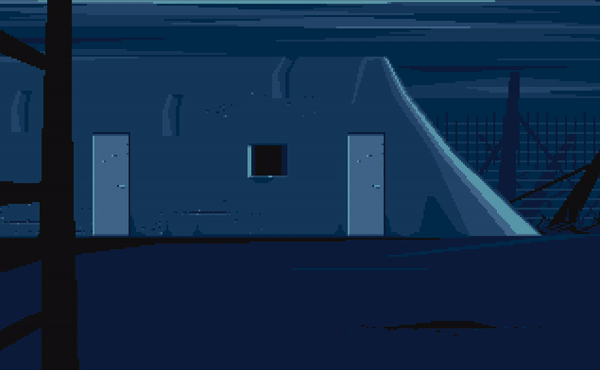

# GOAL

- Learn GO and implement "something fun"
- "something fun" - interpret the old game another world and create a web version (WASM)!

## Next steps

Improve WASM Performance (currently pretty bad).
- use ImageData
- use webworker to decouple main thread from "working"

# Another World References

- https://github.com/cyxx/rawgl
- https://fabiensanglard.net/anotherWorld_code_review/
- https://fabiensanglard.net/another_world_polygons/index.html
- http://www.anotherworld.fr/anotherworld_uk/another_world.htm
- https://www.gdcvault.com/play/1014630/Classic-Game-Postmortem-OUT-OF

# ARCHITECTURE

- Split Backend (parsing, interpreting) and Frontend (rendering audio & video).
- Backend should build as lib so it can be reusable in a web app (WASM target) or SDL2 app
- Local assets are here for dev purpose only - they will go away. thread them as they will be downloaded

## golang elements to check

- iota
- Channels
- interface
- Method (bound functions?)

# Getting started

- Install make (autotools on linux, xcode on OSX)
- Install go 1.14 https://golang.org/dl/
- Check out repo
- Run `./scripts/osx-install.sh` to install/download dependencies or make sure SDL2 (sdl2, sdl2_gfx, sdl2_image, sdl2_mixer, sdl_net) and pkg-config are installed correctly
- Run `make` to build, if it's green you're good
- Use `make help` for more
